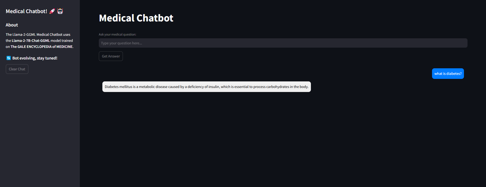

# 🏥 Llama-2-GGML Medical Chatbot 🚀

A **Retrieval-Augmented Generation (RAG) based chatbot** that leverages **Llama-2-GGML** and **FAISS** to provide responses to medical-related queries by searching within **medical PDFs**. The chatbot is powered by **LangChain**, **FAISS vector search**, and a **Streamlit UI**.

---

## 📌 Features
✅ **Retrieval-Augmented Generation (RAG)** - Uses FAISS to search medical PDFs.  
✅ **Llama-2-GGML Model** - Runs locally for private medical Q&A.  
✅ **Streamlit UI** - User-friendly web-based chatbot interface.  
✅ **PDF Knowledge Base** - Users can upload medical PDFs to expand chatbot knowledge.  
✅ **Docker Support** - Easily deployable using **Docker**.  

---

## 📂 Project Structure
```
📁 Llama-2-GGML-Medical-Chatbot
│── 📄 model.py          # Chatbot logic (LangChain RAG + Streamlit UI)
│── 📄 vector.py         # PDF processing & FAISS vector store creation
│── 📄 Dockerfile        # Containerization instructions
│── 📄 requirements.txt  # Required Python libraries
│── 📁 vectorstores/     # FAISS database for PDF storage
│── 📁 data/             # Medical PDFs (for indexing)
│── 📁 assets/           # UI assets (logos, images)
│── 📄 README.md         # Documentation (You are here)
```

---

## 🛠 Installation
### 1️⃣ Clone the Repository
```bash
git clone https://github.com/your-username/Llama-2-GGML-Medical-Chatbot.git
cd Llama-2-GGML-Medical-Chatbot
```

### 2️⃣ Install Dependencies
```bash
pip install -r requirements.txt
```

### 3️⃣ Build the FAISS Vector Store
Before running the chatbot, **index the PDFs**:
```bash
python vector.py
```
🔹 This extracts text from PDFs and stores embeddings in **FAISS**.

### 4️⃣ Run the Chatbot
```bash
streamlit run model.py
```
🔹 Open your browser and go to 👉 **`http://localhost:8501`**

---

## 📦 Running with Docker
### 1️⃣ Build the Docker Image
```bash
docker build -t medical-chatbot .
```

### 2️⃣ Run the Docker Container
```bash
docker run -p 8501:8501 medical-chatbot
```
🔹 Access the chatbot at 👉 **`http://localhost:8501`**


## 🔍 How It Works
### 1️⃣ Process Medical PDFs
- **Extracts medical knowledge** using `vector.py` (FAISS indexing).
- Stores **vector embeddings** for **fast retrieval**.

### 2️⃣ Ask Questions
- The chatbot **retrieves relevant content** from indexed PDFs.
- **Llama-2-GGML** generates a **human-like response**.

### 3️⃣ Retrieve from FAISS
- If **no relevant data is found**, it informs the user instead of hallucinating.

---

## ⚡ Technologies Used
🔹 **Llama-2-GGML** - Open-source LLM optimized for fast CPU inference.  
🔹 **LangChain** - Used for document retrieval and response generation.  
🔹 **FAISS** - Vector search database for PDF embeddings.  
🔹 **Streamlit** - Web UI framework for chatbot interaction.  
🔹 **Docker** - Containerized environment for easy deployment.  

---




## 🤖 Example Usage
### 1️⃣ Upload a Medical PDF
- Upload **The Gale Encyclopedia of Medicine** or other documents.
- The system **processes** and **indexes** the content.

### 2️⃣ Ask a Medical Question
💬 **Example:**
```
User: What are the symptoms of diabetes?
```

🤖 **Response:**
```
The symptoms of diabetes include frequent urination, increased thirst, fatigue, blurred vision, unintended weight loss, and slow healing of wounds.
```


## 📜 License
MIT License - Free to use and modify.

---

## 🤝 Contributing
Want to improve this chatbot? Feel free to:
1. Fork the repo
2. Create a feature branch
3. Submit a pull request 🚀

---

